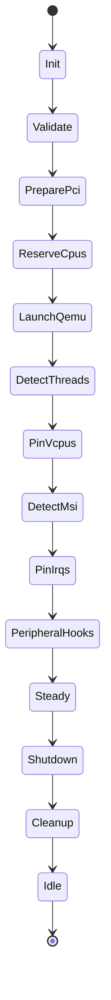

# Chalybs Execution & Architecture (v0.4.1)

> **Authoritative architecture reference for Chalybs v0.4.1**
>
> This document describes:
> - End-to-end VM execution pipeline
> - Deterministic state machine
> - PCI / GPU / VFIO architecture (Phases 1–9 online)
> - NUMA-aware CPU isolation (C2 policy)
> - Device isolation policy (Phase 8)
> - Device isolation *level* enforcement (Phase 9)
> - System layout and forward roadmap  

For change history, see `CHANGELOG.md`.  
For release details, see `RELEASE_NOTES.md`.  
For future plans, see `ROADMAP.md`.

---

## 1. System Overview

Chalybs is a deterministic virtualization orchestrator providing:

- Rust-native, sysfs-driven PCI/VFIO control  
- Strict deterministic state machine for VM lifecycle
- NUMA-aware vCPU/IRQ placement
- Multi-layer passthrough safety policies
- Device isolation mode + device isolation *level* enforcement

Components:

| Component      | Purpose                                                                |
|----------------|------------------------------------------------------------------------|
| `chalybs-core` | Deterministic state machine, VFIO/PCI pipeline, isolation phases       |
| `chalybs`      | CLI wrapper around the core                                             |
| `chalybsd`     | (Future) daemon / long-lived supervisor                                 |

---

## 2. High-Level Architecture

### 2.1 Top-Level Flow

```mermaid
flowchart LR
    subgraph CLI["chalybs (CLI)"]
        A[Parse CLI args] --> B[Load chalybs.toml]
        B --> C[Build VmRuntime]
        C --> D[Create VmStateMachine]
        D --> E[run_until_steady()]
    end

    subgraph CORE
        E --> F[State machine\nPrepare → Steady]
        F --> G[VM steady-state]
        G --> H[run_shutdown()]
    end

    subgraph QEMU["QEMU process"]
        F -.spawn.-> Q[QEMU]
        H -.teardown.-> QX[exit]
    end
```

---

## 3. VM Execution Pipeline (State Machine)

### 3.1 State Diagram



### 3.2 State Responsibilities

- **Init**
- **Validate**
- **PreparePci**  
  *Phases 5–9 combined:*  
  - Inventory  
  - GPU unbind feasibility  
  - Build VFIO plan  
  - **Evaluate isolation policy (Phase 8)**  
  - **Evaluate isolation *levels* (Phase 9)**  
  - Execute VFIO plan  
  - Verify VFIO bindings  
- **ReserveCpus / LaunchQemu / Pinning / Peripheral hooks**
- **Shutdown / Cleanup**

---

## 4. CPU & NUMA Architecture (C2 Policy)

*(unchanged from 0.4.0, remains authoritative)*

---

## 5. PCI / GPU / VFIO Phases

### 5.1 Phase Summary (v0.4.1)

| Phase | Name                                  | Active | Notes |
|-------|----------------------------------------|--------|-------|
| 1     | Inventory                              | ✔      | PCI snapshot |
| 2     | GPU driver classification               | ✔      | host vs vfio |
| 3     | GPU unbind safety simulation           | ✔      | risk-based |
| 4     | VFIO sysfs helpers                     | ✔      | pure helpers |
| 5     | VFIO plan builder                      | ✔      | deterministic |
| 6     | Execute VFIO plan                      | ✔      | sysfs writes |
| 7     | VFIO binding verification              | ✔      | post-bind |
| 8     | Isolation policy (mode + checks)       | ✔      | Audit/Enforce |
| 9     | **Isolation level enforcement**        | ✔ (new in 0.4.1) | new semantic layer |

---

## 6. Phase 8: Device Isolation Policy (Mode-Based)

**Unmodified from v0.4.0 except documentation cleanup.**  
Evaluates:

- IOMMU exclusivity  
- Multifunction consistency  
- Host-critical GPU sharing  

Mode controls behavior (`disabled`, `audit`, `enforce`).

---

## 7. Phase 9: Isolation Level Enforcement (New in v0.4.1)

`IsolationLevel` is **no longer reserved**.

```rust
pub enum IsolationLevel {
    Dedicated,
    SharedWithHost,
    Forbidden,
}
```

### 7.1 VM-Level `default_level`

Used as the policy applied to any PCI device lacking an explicit per-device level.

### 7.2 Enforcement Behavior

| Level            | Meaning                                                                             |
|------------------|-------------------------------------------------------------------------------------|
| `Dedicated`      | Device must not share IOMMU group with host-owned devices                          |
| `SharedWithHost` | Sharing is allowed, but conflicts may still generate warnings                       |
| `Forbidden`      | Device cannot be passed through at all                                              |

### 7.3 Enforcement Timing

Phase 9 runs **after** Phase 8 validation but **before** any VFIO sysfs writes.

### 7.4 Current Scope (v0.4.1)

- Level affects policy decisions and device validation.
- No breaking behavior is introduced relative to v0.4.0.
- Per-device overrides enabled via `PciDeviceConfig.level`.

---

## 8. Configuration Surfaces

Updated to reflect:

- Active `IsolationLevel`
- Active `default_level`
- Per-device level overrides

---

## 9. Peripheral Execution Model  
*(unchanged)*

---

## 10. Bring-Up & Shutdown Sequences  
*(unchanged)*

---

## 11. Summary

Chalybs v0.4.1 delivers:

- **Phase 9 isolation level enforcement now active**
- Full synchronization of config struct → planner → verifier → isolation engines
- All tests passing; deterministic behavior preserved
- Clippy-clean codebase

This document is now the canonical reference for **v0.4.1**.
