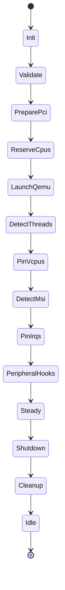
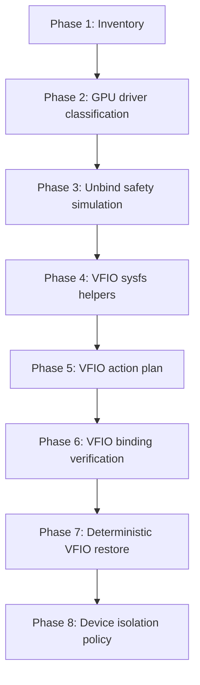
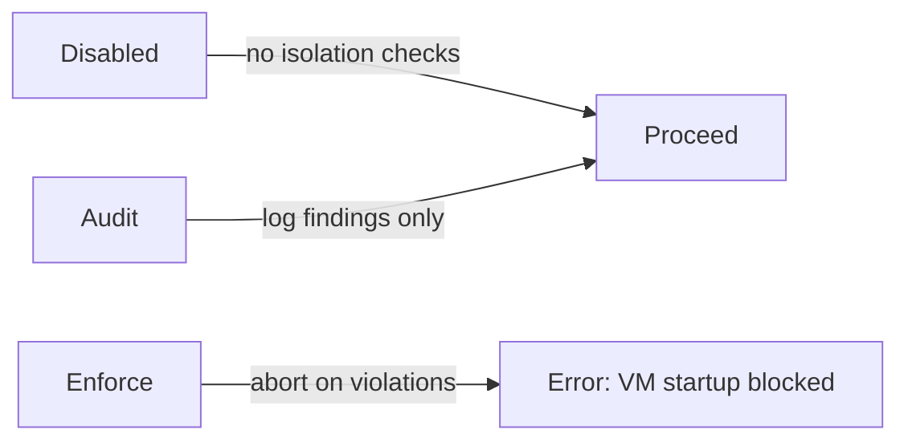
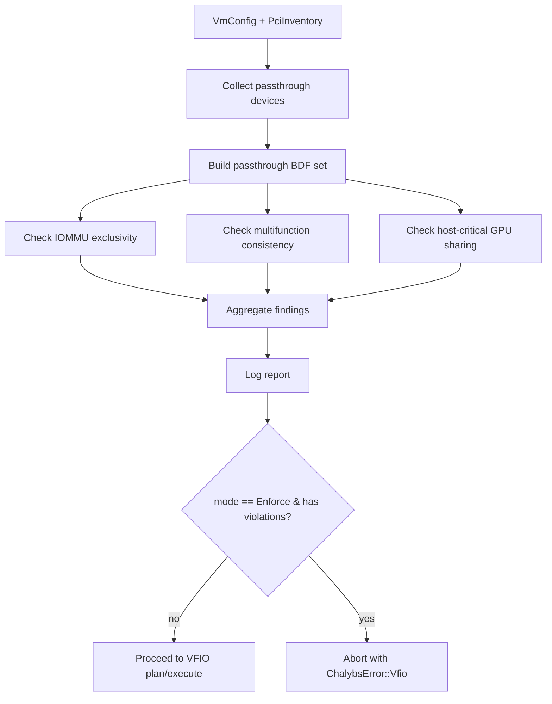
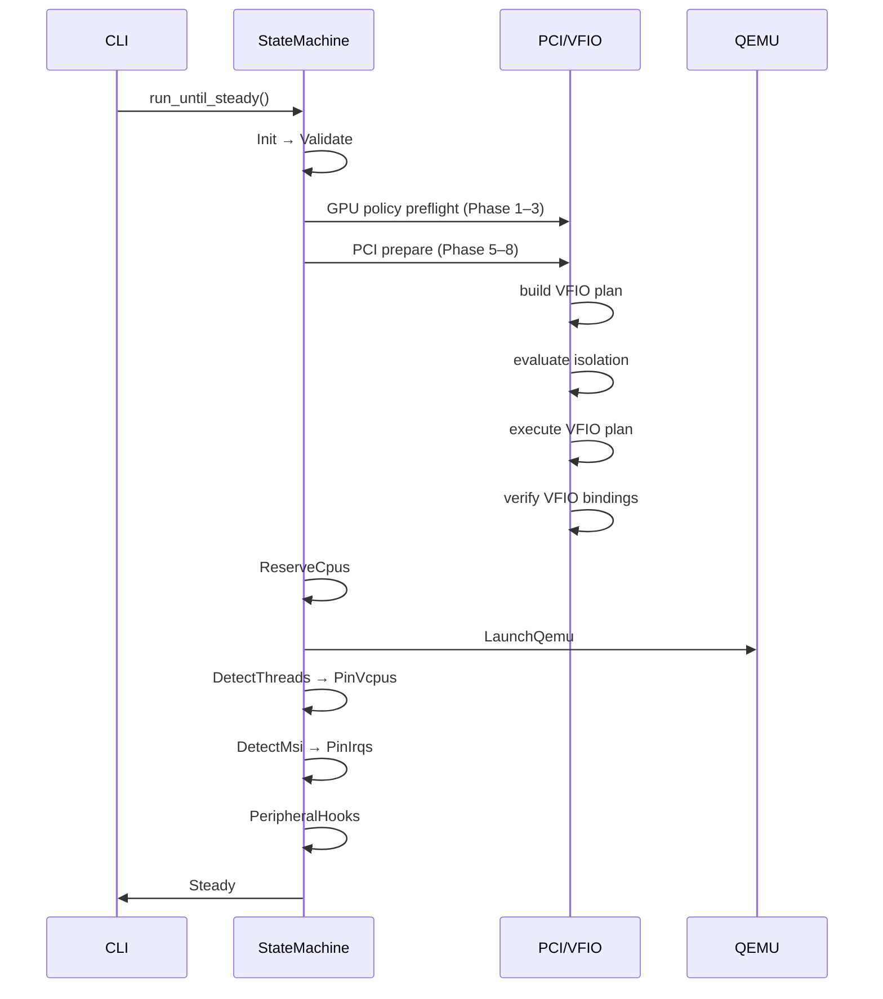
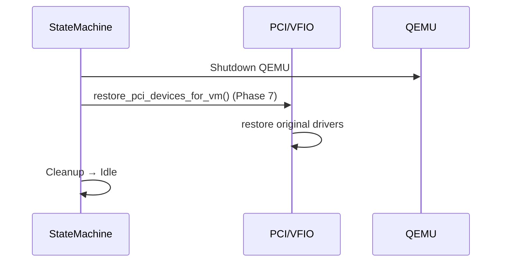

# Chalybs Execution & Architecture (v0.4.0)

> **Authoritative architecture reference for Chalybs v0.4.0**
>
> This document describes:
> - End-to-end VM execution pipeline
> - Deterministic state machine
> - PCI / GPU / VFIO architecture (Phases 1–8 complete)
> - NUMA-aware CPU isolation (C2 policy)
> - Device isolation policy (Phase 8)
> - System layout and future direction

For change history, see `CHANGELOG.md`.  
For release details, see `RELEASE_NOTES.md`.  
For future plans, see `ROADMAP.md`.

---

## 1. System Overview

Chalybs is a deterministic virtualization orchestrator with:

- Rust-native, sysfs-driven PCI/VFIO control
- Deterministic VM bring-up and teardown
- NUMA-aware CPU / IRQ orchestration
- Safety policy layers for GPU and PCI passthrough

It is composed of:

| Component      | Purpose                                                           |
|----------------|-------------------------------------------------------------------|
| `chalybs-core` | Library containing state machine, configs, PCI/VFIO logic         |
| `chalybs`      | CLI wrapper around core                                           |
| `chalybsd`     | (Future) daemon with control-plane API and long-lived VM lifecycles |

---

## 2. High-Level Architecture

### 2.1 Top-Level Flow

```mermaid
flowchart LR
    subgraph CLI["chalybs (CLI)"]
        A[Parse CLI args] --> B[Load chalybs.toml]
        B --> C[Build VmRuntime]
        C --> D[Create VmStateMachine]
        D --> E[run_until_steady()]
    end

    subgraph CORE["chalybs-core"]
        E --> F[State machine\nPrepare → Steady]
        F --> G[VM steady-state]
        G --> H[run_shutdown()]
    end

    subgraph QEMU["QEMU process"]
        F -.spawn.-> Q[QEMU process]
        H -.teardown.-> QX[QEMU exit]
    end
```

The central coordinator is the state machine in `core/src/state.rs`, which drives
a VM from initial validation through steady-state and back down through shutdown
and VFIO restore.

---

## 3. VM Execution Pipeline (State Machine)

### 3.1 State Diagram



### 3.2 State Responsibilities

- **Init**
  - Pure entry state; no side effects.

- **Validate**
  - Validate configuration and host environment:
    - Top-level `RootConfig` sanity (`RootConfig::validate`)
    - cpuset preflight (`cpuset::preflight`)
    - QEMU binary + arguments (`qemu::preflight`)
    - GPU policy preflight:
      - `config::pci::preflight_gpu_policy(vm_name, &VmConfig)`

- **PreparePci** (Phases 5–8)
  - Build host PCI inventory (`PciInventory::scan`).
  - Build VFIO staging plan (Phase 5).
  - Evaluate device isolation policy (Phase 8):
    - `vfio::isolation::evaluate_isolation_for_vm(vm_name, &VmConfig, &PciInventory)`
  - Execute VFIO plan (Phase 5) using sysfs helpers (Phase 4).
  - Verify final VFIO bindings (Phase 6).

- **ReserveCpus**
  - Derive host CPUs using C2 policy (NUMA-aware).
  - Create cpuset hierarchy:
    - `vfio_vm` (VM vCPUs)
    - `vfio_host` (remaining host CPUs)

- **LaunchQemu**
  - Spawn QEMU with configured:
    - vCPU topology and count
    - guest memory
    - OVMF CODE/VARS
    - additional devices / arguments from config

- **DetectThreads**
  - Wait for QEMU vCPU threads to appear.
  - Discover vCPU `tid`s.

- **PinVcpus**
  - Set CPU affinity for vCPU threads to `vm_cpus`.

- **DetectMsi**
  - Wait for MSI/MSI-X IRQs to be allocated.

- **PinIrqs**
  - Assign IRQ affinities according to host/VM layout.

- **PeripheralHooks**
  - Apply peripheral actions (if configured):
    - Tasmota power control
    - DDC input switching
    - Looking Glass shared memory
  - Ensure host-side peripherals follow VM lifecycle.

- **Steady**
  - VM is fully up; CPUs and IRQs pinned; peripherals configured.

- **Shutdown**
  - Tear down QEMU process.
  - Perform deterministic VFIO restore (Phase 7) for all passthrough devices.

- **Cleanup**
  - Remove / reset cpusets.
  - Perform any remaining cleanup needed to bring the system back to idle.

- **Idle**
  - Terminal state after shutdown; no resources held.

---

## 4. CPU & NUMA Architecture (C2 Policy)

Chalybs uses a NUMA-aware policy (C2) to derive host CPUs when the user does not
explicitly override them. The main goal is to keep host workloads away from the
NUMA domains backing the guest vCPUs.

### 4.1 Topology Discovery

Topology comes from sysfs:

- `/sys/devices/system/cpu/online`
- `/sys/devices/system/node/nodeN/cpulist`

An internal `NumaTopology` abstraction exposes:

- `node_cpus: BTreeMap<u32, Vec<u32>>`
- `online_cpus: Vec<u32>`

If no NUMA nodes exist, Chalybs collapses the topology into a single synthetic
node (0) containing all online CPUs.

### 4.2 C2 Host CPU Derivation

```mermaid
flowchart TD
    A[vm_cpus] --> B[discover_numa_topology()]
    B --> C[vm_nodes = nodes_for_cpus(vm_cpus)]
    C --> D{vm_nodes empty?}
    D -->|yes| E[Error: inconsistent topology]
    D -->|no| F[host_nodes = all_nodes - vm_nodes]
    F --> G{host_nodes non-empty?}
    G -->|yes| H[host_cpus = CPUs on host_nodes]
    G -->|no| I[host_cpus = online_cpus - vm_cpus]
    H --> J[Validate host_cpus non-empty]
    I --> J
```

Summary:

- If there are nodes not referenced by `vm_cpus`:
  - Host CPUs = all CPUs on those nodes.
- Otherwise:
  - Host CPUs = `online_cpus - vm_cpus`.

If `host_cpus` is empty, Chalybs errors rather than building a useless host
cpuset.

### 4.3 cpuset Layout

During cpuset creation:

- `vfio_vm` cpuset:
  - `cpuset.cpus` = `vm_cpus`
  - `cpuset.mems` = NUMA nodes for `vm_cpus`
- `vfio_host` cpuset:
  - `cpuset.cpus` = derived `host_cpus`
  - `cpuset.mems` = NUMA nodes for `host_cpus`

This cleanly separates VM and host CPU/memory domains.

---

## 5. PCI / GPU / VFIO Phases

Chalybs decomposes PCI/VFIO handling into eight phases:



At v0.4.0, **all eight phases are implemented**.

### 5.1 Phase 1: Inventory (`core/src/pci.rs`)

`PciInventory::scan()` builds a vector of `PciFunction` values from
`/sys/bus/pci/devices/*`:

- `bdf: String` – `0000:0b:00.0`
- `vendor_id: u16`
- `device_id: u16`
- `class: u32` – raw class code (e.g., `0x030000` for VGA)
- `driver: Option<String>` – bound driver (`vfio-pci`, `amdgpu`, ...)
- `iommu_group: Option<u32>`
- `numa_node: Option<i32>`

Helpers:

- `is_display_controller()`
- `is_network_controller()`
- `is_storage_controller()`
- `is_nvme()`
- `is_usb_controller()`

Inventory-level grouping:

- `by_iommu_group() -> HashMap<u32, Vec<&PciFunction>>`
- Convenience filters for GPU/NVMe/NIC/USB subsets
- `resolve_configured(&[PciDeviceConfig]) -> Result<Vec<&PciFunction>>`

All of this is **read-only** and strictly from sysfs.

### 5.2 Phase 2: GPU Driver & Safety Classification

For display controllers, Chalybs assigns:

```rust
enum GpuDriverKind {
    Vfio,
    AmdGpu,       // amdgpu or radeon
    Nvidia,       // proprietary NVIDIA
    Nouveau,      // open-source NVIDIA
    OtherKernel(String),
    Unbound,
}

enum GpuSafetyClass {
    VfioReady,    // already bound to vfio-pci
    HostOwned,    // bound to amdgpu/nvidia/nouveau
    Unknown,      // unbound or unknown driver
}
```

`PciInventory::gpu_summaries()` provides a summarized view for logging and
policy evaluation. This is still read-only.

### 5.3 Phase 3: Unbind Safety Simulation

Chalybs simulates what would happen if it unbound a GPU from its current driver,
without touching sysfs:

```rust
enum GpuUnbindFeasibility {
    Safe,
    Risky(String),
    Unsafe(String),
}

struct GpuUnbindAssessment {
    pub bdf: String,
    pub current_driver: Option<String>,
    pub safety_class: GpuSafetyClass,
    pub iommu_group: Option<u32>,
    pub group_members: Vec<String>,
    pub feasibility: GpuUnbindFeasibility,
}
```

Heuristics:

- No IOMMU group → `Unsafe("no IOMMU group")`
- Group contains host-owned GPUs or mixed device classes → `Risky(...)`
- Group contains only vfio-bound/unbound GPUs → `Safe`

Used as input to Phase 5 planning.

### 5.4 Phase 4: Minimal VFIO Helpers

Minimal, deterministic sysfs helpers on `PciFunction`:

```rust
impl PciFunction {
    pub fn unbind_current_driver(&self) -> Result<()>;
    pub fn bind_to_vfio_pci(&self) -> Result<()>;
}
```

Behavior:

- `unbind_current_driver()`:
  - If no driver → no-op.
  - Else write BDF to `/sys/bus/pci/drivers/<driver>/unbind`.

- `bind_to_vfio_pci()`:
  - If already `vfio-pci` → no-op.
  - Else write BDF to `/sys/bus/pci/drivers/vfio-pci/bind`.

These helpers encode **no policy**, only mechanics.

### 5.5 Phase 5: VFIO Action Plan (Plan)

Phase 5 constructs an ordered list of VFIO operations (a “plan”) per VM:

- Input:
  - VM config (`VmConfig`)
  - PCI inventory (`PciInventory`)
  - GPU unbind assessments (Phase 3)
- Output:
  - Sequence of operations:
    - Unbind GPU drivers
    - Unbind other devices (NVMe/NIC/USB)
    - Bind all configured devices to `vfio-pci`

The planner remains pure (no sysfs), producing an in-memory plan that is later
executed by the VFIO executor.

### 5.6 Phase 6: VFIO Binding Verification (Verify)

After executing the plan, Chalybs verifies that reality matches intent:

- Re-scan inventory.
- Confirm that all configured passthrough devices are:
  - Present
  - Bound to `vfio-pci`
- On mismatch:
  - Emit detailed diagnostics.
  - Fail VM startup before QEMU launch.

### 5.7 Phase 7: Deterministic VFIO Restore (Shutdown)

On shutdown:

- Chalybs re-scans inventory.
- Computes a **restore plan**:
  - For each device, restore its original driver (if any).
  - Skip devices that were originally unbound or vfio-bound.
- Executes restore in a deterministic order (usually GPU → NVMe → NIC → USB).
- Optionally performs a PCI bus rescan (configurable).

The restore path is purely mechanical and does not involve policy decisions.

---

## 6. Phase 8: Device Isolation Policy

Phase 8 introduces a per-VM device isolation policy:

```rust
#[derive(Debug, Deserialize, Clone, Copy, PartialEq, Eq)]
#[serde(rename_all = "snake_case")]
pub enum IsolationMode {
    Disabled,
    Audit,
    Enforce,
}

#[derive(Debug, Deserialize, Clone, Copy, PartialEq, Eq)]
#[serde(rename_all = "snake_case")]
pub enum IsolationLevel {
    Dedicated,
    SharedWithHost,
    Forbidden,
}

#[derive(Debug, Deserialize, Clone, Copy)]
pub struct IsolationPolicyConfig {
    pub mode: IsolationMode,
    pub default_level: IsolationLevel,
    pub require_iommu_exclusive: bool,
    pub require_multifunction_consistency: bool,
    pub forbid_host_critical_in_group: bool,
}
```

### 6.1 Isolation Modes



- **Disabled**
  - Skip Phase 8; behavior matches pre-Phase-8 Chalybs.
- **Audit**
  - Evaluate isolation; log findings as info/warnings; never block.
- **Enforce**
  - Treat violations as hard errors; fail before any VFIO sysfs writes.

Defaults:

- `mode = Disabled`
- `default_level = Dedicated`
- All booleans default to `true`.

### 6.2 Checks Performed

Phase 8 currently implements three checks via `evaluate_isolation_for_vm`:

1. **IOMMU Group Exclusivity**

   If `require_iommu_exclusive = true`:

   - For each IOMMU group containing any passthrough device:
     - If the same group contains non-passthrough devices:
       - Emit violation `IOMMU_GROUP_NOT_EXCLUSIVE`.

2. **Multifunction Consistency**

   If `require_multifunction_consistency = true`:

   - Group devices by `(domain, bus, slot)` (i.e. multi-function group).
   - If some functions are passthrough and some are host-owned:
     - Emit violation `MULTIFUNCTION_MIXED_OWNERSHIP`.

3. **Host-Critical GPU Sharing**

   If `forbid_host_critical_in_group = true`:

   - For each IOMMU group with passthrough devices:
     - If the same group contains a GPU classified as `HostOwned`
       (amdgpu/nvidia/nouveau):
       - Emit violation `HOST_CRITICAL_GPU_SHARED_GROUP`.

### 6.3 Findings Model

Each check produces `IsolationFinding` values:

```rust
pub enum IsolationSeverity {
    Info,
    Warning,
    Violation,
}

pub struct IsolationFinding {
    pub severity: IsolationSeverity,
    pub code: &'static str,
    pub message: String,
    pub device_bdf: Option<String>,
    pub iommu_group: Option<u32>,
}

pub struct IsolationReport {
    pub vm_name: String,
    pub findings: Vec<IsolationFinding>,
}
```

Logging behavior:

- All findings are logged with structured fields.
- Severity is reflected in tracing level (`info` vs `warn`).

Enforcement behavior:

- `IsolationMode::Disabled` → report is ignored.
- `IsolationMode::Audit` → log only.
- `IsolationMode::Enforce` → if any `Violation` exists:
  - Count them.
  - Fail VM startup with a clear error message.

### 6.4 Evaluation Flow



Phase 8 is purely above the VFIO plan/execute/verify stages. If Enforce-mode
violations exist, **no sysfs writes occur**.

---

## 7. Configuration Surfaces

### 7.1 RootConfig

```rust
pub struct RootConfig {
    pub vm: HashMap<String, VmConfig>,
    pub logging: Option<LoggingConfig>,
}
```

- `vm` is a map `name → VmConfig` (e.g. `vm.win11-gpu`).
- `logging` controls global logging output.

### 7.2 VmConfig Highlights

```rust
pub struct VmConfig {
    pub cpu: CpuConfig,
    pub qemu: QemuConfig,
    pub numa: Option<NumaConfig>,
    pub devices: DevicesConfig,
    pub gpu: GpuPolicyConfig,
    pub isolation: IsolationPolicyConfig,
    pub peripherals: Option<PeripheralConfig>,
}
```

Key fields:

- `cpu` – vCPU mapping (`host_cpus`, `vm_cpus`)
- `qemu` – binary path, args, vCPU count, memory, OVMF images
- `numa` – preferred NUMA node for vCPUs / IRQs
- `devices` – GPU, NVMe, NIC, USB pass-through lists
- `gpu` – single-GPU safety and future GPU policy toggles
- `isolation` – Phase 8 device isolation policy
- `peripherals` – Tasmota, DDC, Looking Glass wiring

---

## 8. Peripheral Execution Model

Peripherals are configured via `PeripheralConfig` and applied in the
`PeripheralHooks` state after CPU/IRQ pinning:

- **Tasmota** – VM-aware power control for the host or attached equipment.
- **DDC** – Display input switching for host/VM.
- **Looking Glass** – Shared memory for low-latency VM display.

Peripherals are expected to evolve into a richer “scene graph” but are
already lifecycle-aware in v0.4.0.

---

## 9. End-to-End Bring-Up & Shutdown

### 9.1 Bring-Up (Simplified)



### 9.2 Shutdown (Simplified)



---

## 10. Future Direction (v0.4.x → v1.0)

Planned evolutions:

- Richer isolation policies (per-device overrides, class-based rules).
- Multi-GPU arbitration and policy (iGPU/dGPU selection).
- NUMA/IRQ advisor with “what-if” simulations.
- A full daemon (`chalybsd`) with control-plane and UI integration.
- “Hardened mode” that further constrains nondeterministic behaviors.

---

## 11. Summary

Chalybs v0.4.0 delivers:

- A clear, deterministic VM state machine.
- NUMA-aware CPU and IRQ placement (C2 policy).
- A complete, testable PCI/VFIO pipeline (Phases 1–8).
- Device isolation policy with Disabled/Audit/Enforce modes.
- Deterministic VFIO restore on shutdown.
- Extensible configuration surfaces aligned with future growth.

This document is the canonical reference for how those pieces fit together in
v0.4.0.
