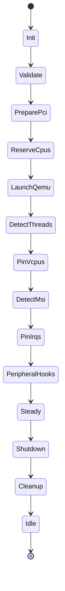
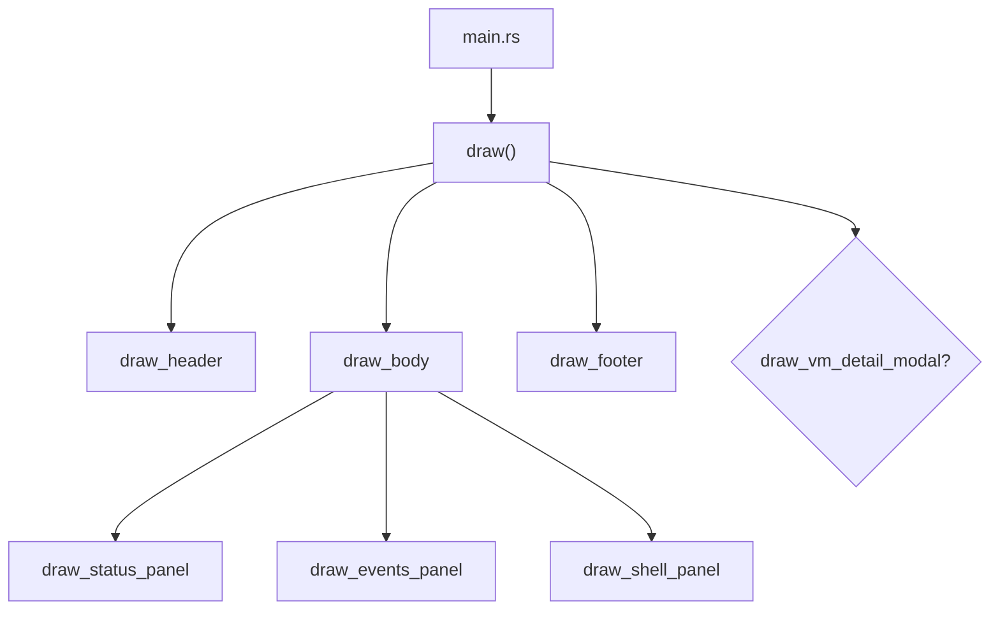

# Chalybs Execution & Architecture (v1.0.0)

> **Authoritative architecture reference for Chalybs v1.0.0**
>
> This document describes:
> - End-to-end VM execution pipeline
> - Deterministic state machine
> - PCI / GPU / VFIO architecture (Phases 1–9 online)
> - NUMA-aware CPU isolation (C2 policy)
> - Device isolation policy (Phase 8)
> - Device isolation *level* enforcement (Phase 9)
> - System layout and forward roadmap  

For change history, see `CHANGELOG.md`.  
For release details, see `RELEASE_NOTES.md`.  
For future plans, see `ROADMAP.md`.

---

## 1. System Overview

Chalybs is a deterministic virtualization orchestrator providing:

- Rust-native, sysfs-driven PCI/VFIO control  
- Strict deterministic state machine for VM lifecycle
- NUMA-aware vCPU/IRQ placement
- Multi-layer passthrough safety policies
- Device isolation mode + device isolation *level* enforcement

Components:

| Component      | Purpose                                                                |
|----------------|------------------------------------------------------------------------|
| `chalybs-core` | Deterministic state machine, VFIO/PCI pipeline, isolation phases       |
| `chalybs`      | CLI wrapper around the core                                             |
| `chalybsd`     | (Future) daemon / long-lived supervisor                                 |

---

## 2. High-Level Architecture

### 2.1 Top-Level Flow

```mermaid
flowchart LR
    subgraph CLI["chalybs (CLI)"]
        A[Parse CLI args] --> B[Load chalybs.toml]
        B --> C[Build VmRuntime]
        C --> D[Create VmStateMachine]
        D --> E[run_until_steady()]
    end

    subgraph CORE
        E --> F[State machine\nPrepare → Steady]
        F --> G[VM steady-state]
        G --> H[run_shutdown()]
    end

    subgraph QEMU["QEMU process"]
        F -.spawn.-> Q[QEMU]
        H -.teardown.-> QX[exit]
    end
```

---

## 3. VM Execution Pipeline (State Machine)

### 3.1 State Diagram



### 3.2 State Responsibilities

- **Init**
- **Validate**
- **PreparePci**  
  *Phases 5–9 combined:*  
  - Inventory  
  - GPU unbind feasibility  
  - Build VFIO plan  
  - **Evaluate isolation policy (Phase 8)**  
  - **Evaluate isolation *levels* (Phase 9)**  
  - Execute VFIO plan  
  - Verify VFIO bindings  
- **ReserveCpus / LaunchQemu / Pinning / Peripheral hooks**
- **Shutdown / Cleanup**

---

## 4. CPU & NUMA Architecture (C2 Policy)

*(unchanged from 0.4.0, remains authoritative)*

---

## 5. PCI / GPU / VFIO Phases

### 5.1 Phase Summary (v0.4.1)

| Phase | Name                                  | Active | Notes |
|-------|----------------------------------------|--------|-------|
| 1     | Inventory                              | ✔      | PCI snapshot |
| 2     | GPU driver classification               | ✔      | host vs vfio |
| 3     | GPU unbind safety simulation           | ✔      | risk-based |
| 4     | VFIO sysfs helpers                     | ✔      | pure helpers |
| 5     | VFIO plan builder                      | ✔      | deterministic |
| 6     | Execute VFIO plan                      | ✔      | sysfs writes |
| 7     | VFIO binding verification              | ✔      | post-bind |
| 8     | Isolation policy (mode + checks)       | ✔      | Audit/Enforce |
| 9     | **Isolation level enforcement**        | ✔ (new in 0.4.1) | new semantic layer |

---

## 6. Phase 8: Device Isolation Policy (Mode-Based)

**Unmodified from v0.4.0 except documentation cleanup.**  
Evaluates:

- IOMMU exclusivity  
- Multifunction consistency  
- Host-critical GPU sharing  

Mode controls behavior (`disabled`, `audit`, `enforce`).

---

## 7. Phase 9: Isolation Level Enforcement (New in v0.4.1)

`IsolationLevel` is **no longer reserved**.

```rust
pub enum IsolationLevel {
    Dedicated,
    SharedWithHost,
    Forbidden,
}
```

### 7.1 VM-Level `default_level`

Used as the policy applied to any PCI device lacking an explicit per-device level.

### 7.2 Enforcement Behavior

| Level            | Meaning                                                                             |
|------------------|-------------------------------------------------------------------------------------|
| `Dedicated`      | Device must not share IOMMU group with host-owned devices                          |
| `SharedWithHost` | Sharing is allowed, but conflicts may still generate warnings                       |
| `Forbidden`      | Device cannot be passed through at all                                              |

### 7.3 Enforcement Timing

Phase 9 runs **after** Phase 8 validation but **before** any VFIO sysfs writes.

### 7.4 Current Scope (v0.4.1)

- Level affects policy decisions and device validation.
- No breaking behavior is introduced relative to v0.4.0.
- Per-device overrides enabled via `PciDeviceConfig.level`.

---

## 8. Configuration Surfaces

Updated to reflect:

- Active `IsolationLevel`
- Active `default_level`
- Per-device level overrides

---

## 9. Peripheral Execution Model  
*(unchanged)*

---

## 10. Bring-Up & Shutdown Sequences  
*(unchanged)*

---

## 11. Summary

Chalybs v0.4.1 delivers:

- **Phase 9 isolation level enforcement now active**
- Full synchronization of config struct → planner → verifier → isolation engines
- All tests passing; deterministic behavior preserved
- Clippy-clean codebase

This document is now the canonical reference for **v0.4.1**.

---

## 12. TUI Subsystem Architecture (v0.5.0)

The TUI is a standalone frontend designed to remain backend-agnostic. It interacts
with the system exclusively through the `ChalybsBackend` trait.

### 12.1 Modules

| File              | Responsibility                                          |
|-------------------|----------------------------------------------------------|
| `app.rs`          | Pure state, event buffers, VM list, scroll logic         |
| `ui.rs`           | Layout + rendering of all panels + modal system          |
| `theme.rs`        | Palette, semantic styles, modal/scrim layers             |
| `logo.rs`         | ASCII logo + future kitty-graphics renderer abstraction  |

### 12.2 Render Tree



12.4 Backend Boundary (Stable)
```pub trait ChalybsBackend {
    fn initial_vms(&self) -> Vec<VmStatus>;
    fn refresh_status(&mut self, vms: &mut [VmStatus]);
    fn poll_events(&mut self) -> Vec<AppEvent>;
    fn handle_shell_command(&mut self, command: &str) -> Vec<AppEvent>;
}```


---

## 12.5 TUI Visual Effects Engine (v1.0.0)

The `chalybs-tui` frontend now has a first-class **visual effects engine** that is
deliberately **aesthetic-only**: it never affects the VM control plane, daemon
state machine, or PCI pipeline. Everything is derived from deterministic inputs
(`tick_count`, per-panel salt values, and static configuration) so the TUI remains
repeatable and debuggable.

### 12.5.1 Effect Flags and Persistence

Effects are controlled by the `VisualEffects` struct in `tui/src/app.rs`:

- `pulse` – enables breathing / heartbeat-style glyph animations for VM state
  indicators.
- `scanlines` – applies subtle scanline-style banding in the events pane to keep
  dense logs visually readable without feeling flat.
- `matrix` – draws a low-key "watermark" of drifting dots and occasional glyphs
  in the events list, evoking a background data waterfall without overwhelming
  real log lines.
- `border_noise` – adds very subtle EMI-style shimmer to panel borders using
  per-panel salts, long-tail rare bursts, and dual-frequency micro-variation.
- `badges` – controls whether extended VM micro-badges (ISO / TAS / CPU / IRQ)
  are rendered when layout width allows.
- `logo_reactive` – reserved flag for logo reactivity; currently wired into the
  configuration but intentionally left behaviorally minimal in v1.0.0.
- `load_index` – enables single-row "sparkline" load gauges in the header and
  per-VM rows (synthetic for now, daemon-backed in a future release).

Configuration is loaded and saved via:

- `VisualEffects::load_from_disk()`
- `VisualEffects::save_to_disk()`

using `XDG_CONFIG_HOME/chalybs/tui.conf` or `~/.config/chalybs/tui.conf`. The file
is a simple `key = value` boolean map, and users can also toggle flags at runtime
through the **local TUI shell**:

```text
effects status
effects on
effects off
effects scanlines on
effects border off
effects save
```

### 12.5.2 VM List Layout and Load Sparkline

The VM status panel (`tui/src/ui.rs`) now has width-aware layouts:

- **Wide (`>= VM_LAYOUT_WIDTH_FULL`)**
  - Row 1: selection marker, state glyph, VM name, `[STATE]` badge, and compact
    micro-badges: `[ISO: XXX]`, `[TAS: ON/OFF]`, `[CPU]`, `[IRQ]`.
  - Row 2: an indented `load ▁▂▃▄▅▆▇█` sparkline driven by `tick_count` +
    `vm_index` when `effects.load_index` is enabled.
- **Medium (`>= VM_LAYOUT_WIDTH_MEDIUM`)**
  - Row 1: marker, glyph, name, `[STATE]`.
  - Row 2: indented `[ISO: XXX]` + `[TAS: ...]` when `effects.badges` is on.
- **Narrow**
  - Single line with just marker, glyph, name, and state badge.

The glyph next to each VM name is a small pulsating dot when `effects.pulse` is
enabled and the VM is not `Stopped`. The pulse is a low-amplitude, low-frequency
cycle (`• → ● → ◉ → ●`) that reads more like a heartbeat than a busy spinner.

The header line also gains an optional synthetic load sparkline when
`effects.load_index` is true:

```text
Chalybs – Forged in Linux ...   [load ▁▂▃▄▅▆▇█]
```

### 12.5.3 Events Panel: Scanlines + Matrix Watermark

The events panel combines two layered effects:

1. **Scanlines (`effects.scanlines`)**

   - Every row’s base style is modulated by a drifting band index derived from
     `row_index + tick_count / 8`.
   - Bands alternate between `palette::BG`, `palette::PANEL_BG`, and a dimmed
     variant of the base color, creating a very shallow CRT-like banding that
     slowly slides over time.
   - One band is left unmodified so the overall look remains calm, not noisy.

2. **Matrix Watermark (`effects.matrix`)**

   - Each event row receives a tiny prefix:
     - Primarily `·` / `˙` dots that drift over time and by row index.
     - Occasionally replaced with a more chaotic, but still rare, glyph from a
       small ANSI-ish set to give a "Gibson" feel without devolving into
       neon-vomit.
   - The prefix is intentionally short (1–2 characters) so real log text stays
     aligned and legible.

All glyph choices and timing are deterministic functions of `tick_count` and
`row_index`, keeping the effect reproducible while still feeling organic.

### 12.5.4 Panel Border EMI Shimmer

Panel borders (VMs, Events, Shell, and the VM detail modal) use
`panel_border_style(tick, salt, &effects)` to compute a subtle EMI-like shimmer:

- A per-panel `salt` ensures panels never blink in lockstep.
- A deterministic pseudo-random `seed` is derived from `tick` + `salt`; there is
  **no** global RNG.
- Always-on **hiss**:
  - Small, single-step variations between `dim_text`, `dim+DIM`, and
    `normal+DIM` so borders never look perfectly static on modern high-DPI
    terminals.
- **Rare bursts**:
  - With low probability and random durations (20–120 frames), a panel briefly
    brightens to `normal` or `normal+BOLD` before decaying back to the hiss
    baseline.
- **Two-frequency superposition**:
  - A slow LF wobble (`tick / 9`) and faster HF component (`tick / 2`) are
    combined to decide how strong the current frame’s shimmer should be.

The result is a low-level sense of life in the panels—closer to RF noise on a
lab bench than a blinking "NO VACANCY" sign.


---

## 10. v1.2.2 Implementation Notes (VFIO, Hugepages, IRQ worker, Tasmota)

This section records how the v1.2.2 work maps onto the phase model without rewriting
the earlier narrative sections.

### 10.1 PCI / VFIO lifecycle

- **Staging behaviour**
  - During `PreparePci`, any device that is already bound to `vfio-pci` is treated as
    a dedicated passthrough device for the VM.
  - These devices are logged as "already vfio-bound at staging time" and **no restore
    transition is recorded** for them. In other words, the system treats them as
    "always-vfio" from the host’s perspective.
- **Isolation logging**
  - Phase 2 remains detection-only for host-owned GPUs bound to host graphics drivers;
    they are classified as `HostOwned`, and we emit warnings without touching their
    drivers.
  - Phase 8/9 isolation logs explicitly distinguish:
    - IOMMU groups that are fully exclusive to the VM
      (`IOMMU_GROUP_EXCLUSIVE_PASSTHROUGH`), and
    - host-only groups that contain host-owned GPUs but no passthrough devices
      (`HOST_CRITICAL_GPU_SHARED_GROUP_HOST_ONLY`), where the impact is about host
      availability and performance, not safety of passthrough.
- **Shutdown**
  - The PCI restore phase walks the recorded transition list; when there are no
    transitions (e.g. all devices were already vfio-bound), we emit a summary log
    showing total/restored/failed device counts and perform a no-op.

### 10.2 Stateful hugepages manager

- `PrepareHugepages` now manages hugepages as a **stateful resource**:
  - Mount a Chalybs-managed `hugetlbfs` at `/dev/hugepages`.
  - Request a pagecache drop and memory compaction.
  - Raise `nr_hugepages` on the configured NUMA node to satisfy the VM’s
    page-backed-RAM requirements.
  - Log the before/after state (required pages, `nr_hugepages`, `free_hugepages`) so
    failures are diagnosable.
- On shutdown (`step_shutdown`):
  - Reset node-local `nr_hugepages` back to zero.
  - Reset the global `/proc/sys/vm/nr_hugepages` back to zero.
  - Request another pagecache drop + compaction.
  - Unmount `/dev/hugepages` so the host returns to a clean baseline after the VM
    exits.

### 10.3 IRQ worker without a wait timer

- Phase 8 (`DetectMsi`) launches the IRQ worker thread with the full set of devices
  that should have their MSI/MSI-X IRQs pinned to the VM cpuset.
- The old "wait timer" that tried to guess when the guest would finish PCI
  enumeration has been removed. Instead:
  - The worker loops until it can see MSI/MSI-X entries for a given device, then
    pins them immediately to the NUMA-local VM CPUs.
  - There are no arbitrary sleeps in this path; any delay is tied to real discovery
    work.
- Auxiliary GPU audio functions are explicitly treated as low-value from an IRQ
  optimisation perspective: the worker logs that it is skipping them and leaves them
  on the VM cpuset via the device group.

### 10.4 PeripheralHooks + Tasmota

- The `PeripheralHooks` state now encapsulates smart power control via Tasmota:
  - On VM start (transition into "up"), Chalybs publishes `POWER ON` to the configured
    MQTT topic.
  - On VM stop (guest-initiated shutdown or orchestrated stop), Chalybs publishes
    `POWER OFF`.
- Both transitions are logged with:
  - broker address,
  - topic, and
  - payload,
  so failures can be correlated with specific lifecycle phases.

