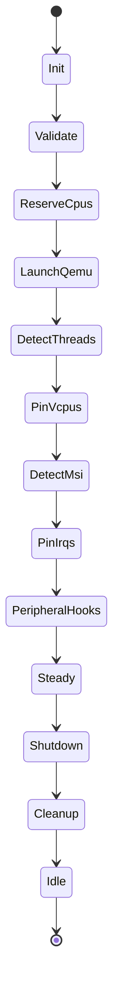

# Chalybs Execution & Architecture (v0.3.3)

> **Scope:** This document is the authoritative reference for how Chalybs 0.3.3
> executes a VM from configuration to steady‑state, with a focus on:
>
> - Execution pipeline and state machine
> - PCI / GPU / VFIO architecture (Phases 1–4 complete)
> - NUMA‑aware CPU derivation and cpuset layout (C2)
> - Mode / capability architecture and safety policy surfaces

For release history and user‑facing changes, see `CHANGELOG.md` and
`RELEASE_NOTES.md`. For roadmap details beyond 0.3.3, see `ROADMAP.md`.

---

## 1. High‑Level System Architecture

Chalybs is split into three main artifacts:

- `chalybs-core` – library with:
  - configuration model
  - state machine
  - PCI / VFIO / NUMA / cpuset logic
  - QEMU launch and shutdown helpers
- `chalybs` – CLI frontend that:
  - loads `chalybs.toml`
  - builds a `VmRuntime`
  - drives the `VmStateMachine`
- `chalybsd` – (future) daemon that:
  - will expose IPC / control plane
  - will orchestrate long‑lived VM lifecycles

### 1.1 High‑Level Flow

```mermaid
flowchart LR
    subgraph CLI["chalybs (CLI)"]
        A[Parse CLI args] --> B[Load config.toml]
        B --> C[Build VmRuntime]
        C --> D[Create VmStateMachine]
        D --> E[run_until_steady()]
    end

    subgraph CORE["chalybs-core"]
        E --> F[State machine\nValidate → Steady]
        F --> G[VM steady-state]
        G --> H[run_shutdown()]
    end

    subgraph QEMU["QEMU process"]
        F -.spawn.-> Q[QEMU binary]
        H -.teardown.-> QX[QEMU exit]
    end
```

The core of Chalybs is the `VmStateMachine`, which progresses the VM through a
deterministic sequence of states from `Init` to `Steady`, then through an
orderly shutdown.

---

## 2. VM Execution Pipeline (State Machine)

The VM lifecycle is encoded in `core/src/state.rs` as a small, explicit state
machine.

### 2.1 State Diagram



### 2.2 State Responsibilities

- **Init**
  - Initial entry; no side effects.
- **Validate**
  - Validate configuration and host environment:
    - CPU set consistency (`cpuset::preflight`)
    - QEMU binary and arguments (`qemu::preflight`)
    - PCI / GPU safety policy (`config::pci::preflight_gpu_policy`)
- **ReserveCpus**
  - Create and configure cgroup v2 cpusets for:
    - `vfio_vm` (VM vCPUs)
    - `vfio_host` (host CPUs not used by the VM)
  - See section **3 – NUMA & C2 Host CPU Derivation**.
- **LaunchQemu**
  - Spawn QEMU with the configured:
    - CPU topology
    - memory size
    - OVMF images
    - additional arguments / devices
- **DetectThreads**
  - Wait for QEMU threads to appear.
  - Discover vCPU thread IDs.
- **PinVcpus**
  - Affinitize VM vCPU threads to the configured `vm_cpus`.
- **DetectMsi**
  - Wait for MSI/MSI‑X IRQs to be registered.
- **PinIrqs**
  - Affinitize VM IRQs to the appropriate CPU sets.
- **PeripheralHooks**
  - Apply peripheral integration (Tasmota, DDC, Looking Glass, etc.)
  - Ensure that host‑side peripherals follow VM lifecycle.
- **Steady**
  - VM is fully up, CPUs and IRQs pinned, peripherals configured.
- **Shutdown / Cleanup / Idle**
  - Tear down QEMU, cpusets, and peripherals as needed.
  - Currently cpuset teardown is non‑destructive (directories left in place).

---

## 3. NUMA & C2 Host CPU Derivation

Chalybs uses a NUMA‑aware policy (C2) to derive host CPUs when the user does
not explicitly specify them. This ensures that the host workload is kept off
the NUMA nodes that back the guest vCPUs whenever possible.

### 3.1 Topology Discovery

Topology is discovered from sysfs:

- `/sys/devices/system/cpu/online` → full online CPU set
- `/sys/devices/system/node/nodeN/cpulist` → per‑node CPU sets

This is wrapped by an internal `NumaTopology` structure with:

- `node_cpus: BTreeMap<u32, Vec<u32>>`
- `online_cpus: Vec<u32>`

If no NUMA nodes are present, Chalybs collapses this to a single node (0)
containing all online CPUs.

### 3.2 C2 Host CPU Derivation

The core logic lives in `derive_host_cpus_from_topology(vm_cpus: &[u32])`:

```mermaid
flowchart TD
    A[vm_cpus] --> B[discover_numa_topology()]
    B --> C[vm_nodes = nodes_for_cpus(vm_cpus)]
    C --> D{vm_nodes empty?}
    D -->|yes| E[Error: topology inconsistent]
    D -->|no| F[host_nodes = all_nodes - vm_nodes]
    F --> G{host_nodes non-empty?}
    G -->|yes| H[host_cpus = CPUs on host_nodes]
    G -->|no| I[host_cpus = online_cpus - vm_cpus]
    H --> J[Validate host_cpus non-empty]
    I --> J
```

Summary:

- If NUMA nodes exist and at least one node is not used by `vm_cpus`:
  - `host_cpus` = all CPUs on those unused nodes.
- Otherwise (single node, or VM consumes all nodes):
  - `host_cpus` = `online_cpus` \ `vm_cpus`.

If the derived `host_cpus` set is empty, Chalybs errors out rather than
creating an unusable host cpuset.

### 3.3 cpuset Layout

During `create_cpuset(rt: &mut VmRuntime)`:

- `vfio_vm` cpuset:
  - `cpuset.cpus` = `vm_cpus`
  - `cpuset.mems` = NUMA nodes for `vm_cpus`
- `vfio_host` cpuset:
  - `cpuset.cpus` = `host_cpus`
  - `cpuset.mems` = NUMA nodes for `host_cpus`

This establishes a clear separation of compute domains for the VM and host.

---

## 4. PCI / GPU / VFIO Architecture (Phases 1–4)

Chalybs models PCI in two layers:

1. **Inventory (what exists)** – `core/src/pci.rs`
2. **Policy (what is allowed)** – `core/src/config.rs::pci`

The philosophy is:

- Inventory is deterministic, sysfs‑only, read‑only.
- Policy consumes inventory and takes responsibility for safety decisions.

### 4.1 PCI Inventory

The PCI inventory scanner builds a list of `PciFunction` structures from
`/sys/bus/pci/devices/*`:

- `bdf: String` – BDF like `0000:0b:00.0`
- `vendor_id: u16`
- `device_id: u16`
- `class: u32` – raw class code (e.g., `0x030000` for VGA)
- `driver: Option<String>` – bound driver name (`vfio-pci`, `amdgpu`, ...)
- `iommu_group: Option<u32>`
- `numa_node: Option<i32>`

Helper methods classify devices by purpose:

- `is_display_controller()`
- `is_network_controller()`
- `is_storage_controller()`
- `is_nvme()`
- `is_usb_controller()`

The `PciInventory` type provides:

- `scan()` – build full inventory from sysfs
- `gpus()` / `nics()` / `nvmes()` / `usb_controllers()`
- `by_iommu_group()` – map `group_id → Vec<&PciFunction>`
- `resolve_configured()` – map config BDFs to `PciFunction`s

### 4.2 GPU Driver & Safety Classification (Phase 2)

For display controllers (`class_base == 0x03`), Chalybs classifies GPUs by
bound kernel driver:

```rust
enum GpuDriverKind {
    Vfio,
    AmdGpu,       // amdgpu or radeon
    Nvidia,       // proprietary
    Nouveau,      // open-source
    OtherKernel(String),
    Unbound,
}
```

Safety classification:

```rust
enum GpuSafetyClass {
    VfioReady,    // bound to vfio-pci
    HostOwned,    // bound to amdgpu/nvidia/nouveau
    Unknown,      // unbound or unknown driver
}
```

Phase 2 is read‑only and purely descriptive. It enables:

- accurate GPU counts for single‑GPU safety policy
- better logging and introspection
- later phases (3–5) to operate on structured classifications instead of
  driver strings.

### 4.3 PCI Policy: Single‑GPU Safety (Phase 2)

The GPU policy lives in `config.rs::pci` and is driven by `GpuPolicyConfig`:

```rust
#[derive(Debug, Deserialize, Clone, Default)]
pub struct GpuPolicyConfig {
    pub allow_single_gpu: bool,
    pub force_use_igpu: bool, // reserved for future use
}
```

The core check is `preflight_gpu_policy(vm_name, &VmConfig)`:

- If VM has **no GPU devices** configured:
  - Preflight is a no‑op.
- If host has **0 GPUs** (by class code):
  - Error if VM requested one.
- If host has **1 GPU**:
  - Require `allow_single_gpu = true`, or abort with a clear message.
- If host has **≥ 2 GPUs**:
  - Always allowed (additional policies may be added later).

Phase 2 also logs GPU summaries (driver, safety) to aid operator decisions.

### 4.4 Unbind Safety Simulation (Phase 3)

Phase 3 adds a way to *simulate* unbind safety for GPUs without actually
touching sysfs.

```rust
enum GpuUnbindFeasibility {
    Safe,
    Risky(String),
    Unsafe(String),
}

struct GpuUnbindAssessment {
    pub bdf: String,
    pub current_driver: Option<String>,
    pub safety_class: GpuSafetyClass,
    pub iommu_group: Option<u32>,
    pub group_members: Vec<String>, // other BDFs in same group
    pub feasibility: GpuUnbindFeasibility,
}
```

`PciInventory::assess_gpu_unbind_safety()`:

- Groups devices by IOMMU group.
- For each GPU:
  - Looks at its safety class.
  - Looks at all devices in its IOMMU group.
  - Assigns `Safe` / `Risky` / `Unsafe`.

Heuristics:

- No IOMMU group → `Unsafe("no IOMMU group")`
- Group contains non‑GPU devices or host‑owned GPUs → `Risky(...)`
- Group contains only vfio‑bound / unbound GPUs → `Safe`

This remains **read‑only**. It is used for operator introspection and as the
basis for Phase 5.

### 4.5 VFIO Bind/Unbind Plumbing (Phase 4)

Phase 4 introduces minimal but correct VFIO sysfs helpers:

```rust
impl PciFunction {
    pub fn unbind_current_driver(&self) -> Result<()>;
    pub fn bind_to_vfio_pci(&self) -> Result<()>;
}
```

Behavior:

- `unbind_current_driver()`:
  - If `driver.is_none()` → no‑op.
  - Otherwise writes BDF to:
    - `/sys/bus/pci/drivers/<driver>/unbind`
- `bind_to_vfio_pci()`:
  - If already bound to `vfio-pci` → no‑op.
  - Otherwise writes BDF to:
    - `/sys/bus/pci/drivers/vfio-pci/bind`

These helpers do **not** encode policy and are not yet wired into the state
machine. They are the building blocks for Phase 5.

### 4.6 PCI/GPU/VFIO Flow Overview

```mermaid
flowchart TD
    A[Inventory scan\nPciInventory::scan()] --> B[Classify GPUs\nGpuDriverKind]
    B --> C[Safety class\nGpuSafetyClass]
    C --> D[Unbind feasibility\nassess_gpu_unbind_safety()]
    D --> E[(Future) Driver transition plan\nPhase 5+]
    E --> F[(Future) Apply transitions\nunbind_current_driver + bind_to_vfio_pci]
```

At v0.3.3, the pipeline is complete through node **D** and the helper APIs for
node **F** are implemented, but no automatic transitions are performed.

---

## 5. Mode & Capability Architecture

Chalybs is moving toward a “mode + capabilities” model where:

- **Modes** describe high‑level user intent (e.g. "PCI‑strict",
  "performance‑biased").
- **Capabilities** describe what the host can safely do (e.g. "multi‑GPU with
  isolated IOMMU group", "NUMA‑aware cpusets available").

In 0.3.3, this architecture is partially realized through:

- `VmConfig`:
  - `cpu`, `qemu`, `numa`, `devices`, `gpu`, `peripherals`
- `GpuPolicyConfig`:
  - `allow_single_gpu`, `force_use_igpu` (placeholder)
- Implicit capabilities derived from:
  - PCI inventory
  - IOMMU group layout
  - NUMA topology
  - availability of vfio‑pci and its sysfs endpoints

Future versions will surface explicit mode names and capability checks, but
the foundational work is already present in the PCI and NUMA subsystems.

---

## 6. Peripheral Architecture (Hooks)

Peripherals are modeled in `PeripheralConfig`:

- `tasmota` – smart‑plug power control
- `ddc` – display input switching
- `looking_glass` – shared memory for low‑latency display

These are activated in the `PeripheralHooks` state:

- After CPUs and IRQs are pinned.
- Before declaring the VM `Steady`.

The design intent is that **peripherals track VM lifecycle**, and can
eventually be extended into a full “peripheral scene graph” that follows
modes/capabilities and VM profiles.

---

## 7. Future Directions (Post‑0.3.3 Sketch)

While this document is anchored at v0.3.3, the architecture is deliberately
shaped to support:

- **Phase 5 – Driver Transition Orchestration**
  - Integrate unbind/bind planning into `VmState::Validate`.
  - Provide clear, auditable logs for every driver transition.
  - Offer a dry‑run mode for “show me what would happen”.

- **Phase 6 – VFIO/IOMMU Policy Engine**
  - Configurable policies for what counts as “safe enough” to proceed.
  - Hard gates against unbinding GPUs that are clearly host‑critical.

- **Phase 7 – Multi‑GPU Runtime Control**
  - Runtime GPU switching.
  - Rebind to host drivers on VM shutdown.
  - Better cooperation with display managers and compositor stacks.

- **Beyond**
  - Richer cpuset / NUMA policies.
  - Disk and network QoS via cgroup v2.
  - A mature daemon (`chalybsd`) with first‑class IPC and UI integration.

---

## 8. Summary

Chalybs 0.3.3 establishes a solid, test‑backed foundation for:

- Deterministic VM execution via a small, explicit state machine.
- NUMA‑aware CPU and cpuset organization (C2 policy).
- PCI inventory and GPU safety modeling through well‑factored phases.
- Read‑only unbind feasibility analysis and VFIO plumbing that is ready
  to be integrated into future policy‑driven phases.

This document is the canonical reference for how those pieces fit together.
