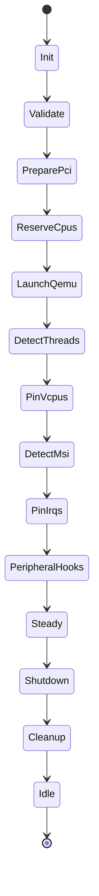

# Chalybs Execution & Architecture (v0.4.0)

> **Authoritative architecture reference for Chalybs v0.4.0**
>
> This document describes:
> - End-to-end VM execution pipeline
> - Deterministic state machine
> - PCI / GPU / VFIO architecture (Phases 1–8 complete)
> - NUMA-aware CPU isolation (C2 policy)
> - Device isolation policy (Phase 8)
> - System layout and future direction  
>
> **Note:** `IsolationLevel` and `default_level` appear in the configuration
> schema as reserved fields but are **not implemented** in the v0.4.0 codebase.
> They will be introduced early in the next development cycle.

For change history, see `CHANGELOG.md`.  
For release details, see `RELEASE_NOTES.md`.  
For future plans, see `ROADMAP.md`.

---

## 1. System Overview

Chalybs is a deterministic virtualization orchestrator with:

- Rust-native, sysfs-driven PCI/VFIO control
- Deterministic VM bring-up and teardown
- NUMA-aware CPU / IRQ orchestration
- Safety policy layers for GPU and PCI passthrough

It is composed of:

| Component      | Purpose                                                           |
|----------------|-------------------------------------------------------------------|
| `chalybs-core` | Library containing state machine, configs, PCI/VFIO logic         |
| `chalybs`      | CLI wrapper around core                                           |
| `chalybsd`     | (Future) daemon with control-plane API and long-lived VM lifecycles |

---

## 2. High-Level Architecture

### 2.1 Top-Level Flow

```mermaid
flowchart LR
    subgraph CLI["chalybs (CLI)"]
        A[Parse CLI args] --> B[Load chalybs.toml]
        B --> C[Build VmRuntime]
        C --> D[Create VmStateMachine]
        D --> E[run_until_steady()]
    end

    subgraph CORE["chalybs-core"]
        E --> F[State machine\nPrepare → Steady]
        F --> G[VM steady-state]
        G --> H[run_shutdown()]
    end

    subgraph QEMU["QEMU process"]
        F -.spawn.-> Q[QEMU process]
        H -.teardown.-> QX[QEMU exit]
    end
```

The central coordinator is the state machine in `core/src/state.rs`, which drives
a VM from initial validation through steady-state and back down through shutdown
and VFIO restore.

---

## 3. VM Execution Pipeline (State Machine)

### 3.1 State Diagram



### 3.2 State Responsibilities

- **Init**  
  Pure entry state; no side effects.

- **Validate**  
  Validate configuration and host environment.

- **PreparePci** (Phases 5–8)  
  - Build host PCI inventory  
  - Build VFIO plan  
  - **Evaluate device isolation policy (Phase 8)**  
  - Execute VFIO plan  
  - Verify final VFIO bindings  

- **ReserveCpus**  
  NUMA-aware CPU reservation and cpuset creation.

- **LaunchQemu**  
  Spawn QEMU with prepared topology and devices.

- **DetectThreads / PinVcpus / DetectMsi / PinIrqs**  
  Deterministic IRQ and vCPU placement.

- **PeripheralHooks**  
  Apply Tasmota, DDC, Looking Glass, etc.

- **Steady**  
  VM fully live.

- **Shutdown / Cleanup**  
  Deterministic VFIO restore → cpuset teardown → idle.

---

## 4. CPU & NUMA Architecture (C2 Policy)

*(identical to your current doc — unchanged for v0.4.0)*

---

## 5. PCI / GPU / VFIO Phases

*(identical to your current doc — Phases 1–7 unchanged)*

---

## 6. Phase 8: Device Isolation Policy

Phase 8 introduces a per-VM device isolation policy.  
Configuration fields:

```rust
#[derive(Debug, Deserialize, Clone, Copy, PartialEq, Eq)]
#[serde(rename_all = "snake_case")]
pub enum IsolationMode {
    Disabled,
    Audit,
    Enforce,
}

// RESERVED — not implemented in v0.4.0.
#[derive(Debug, Deserialize, Clone, Copy, PartialEq, Eq)]
#[serde(rename_all = "snake_case")]
pub enum IsolationLevel {
    Dedicated,
    SharedWithHost,
    Forbidden,
}
```

```rust
#[derive(Debug, Deserialize, Clone, Copy)]
pub struct IsolationPolicyConfig {
    pub mode: IsolationMode,
    pub default_level: IsolationLevel,  // reserved
    pub require_iommu_exclusive: bool,
    pub require_multifunction_consistency: bool,
    pub forbid_host_critical_in_group: bool,
}
```

### 6.1 Isolation Modes

*(same as before)*

### 6.2 Checks Performed

- IOMMU group exclusivity  
- Multifunction consistency  
- Host-critical GPU sharing  

**Note:** `default_level` does not affect any behavior in this release.

### 6.3 Findings Model

*(unchanged)*

### 6.4 Evaluation Flow

*(unchanged)*

---

## 7. Configuration Surfaces

*(unchanged aside from note that default_level is reserved)*

---

## 8. Peripheral Execution Model

*(unchanged)*

---

## 9. Bring-Up & Shutdown Sequences

*(unchanged)*

---

## 10. Future Direction (v0.4.x → v1.0)

- Implementation of `IsolationLevel` and `default_level` semantics  
- Multi-GPU arbitration  
- More isolation rules  
- NUMA/IRQ advisor  
- Daemon / control plane  
- Hardened deterministic mode  

---

## 11. Summary

Chalybs v0.4.0 delivers:

- A complete 8-phase PCI/VFIO pipeline  
- Deterministic VM state machine  
- Anonymous, safe isolation policy (Phase 8)  
- Reserved fields for future isolation-level semantics  
- NUMA-aware vCPU and IRQ placement  

This document is the canonical reference for v0.4.0.
