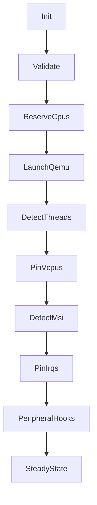

# Chalybs Pipeline – Execution Flow

This describes the complete deterministic bring‑up sequence.

## Mermaid Diagram



## ASCII Diagram

```
+-----------+     +-----------+     +--------------+     +--------------+
|   Init    | --> | Validate  | --> | ReserveCpus  | --> |  LaunchQemu  |
+-----------+     +-----------+     +--------------+     +--------------+
                                                             |
                                                             v
                                                    +-------------------+
                                                    |  DetectThreads   |
                                                    +-------------------+
                                                             |
                                                             v
                                                    +-------------------+
                                                    |    PinVcpus      |
                                                    +-------------------+
                                                             |
                                                             v
                                                    +-------------------+
                                                    |    DetectMsi     |
                                                    +-------------------+
                                                             |
                                                             v
                                                    +-------------------+
                                                    |     PinIrqs      |
                                                    +-------------------+
                                                             |
                                                             v
                                                    +-------------------+
                                                    | PeripheralHooks  |
                                                    +-------------------+
                                                             |
                                                             v
                                                    +-------------------+
                                                    |   SteadyState    |
                                                    +-------------------+
```
